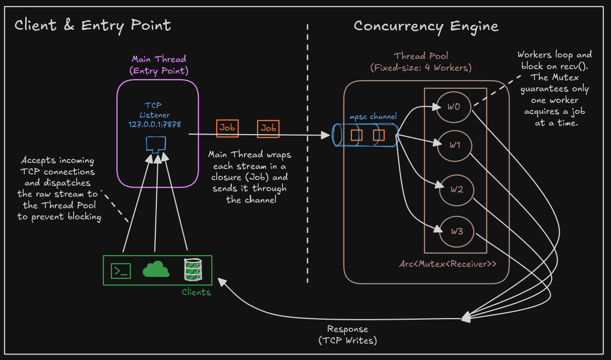
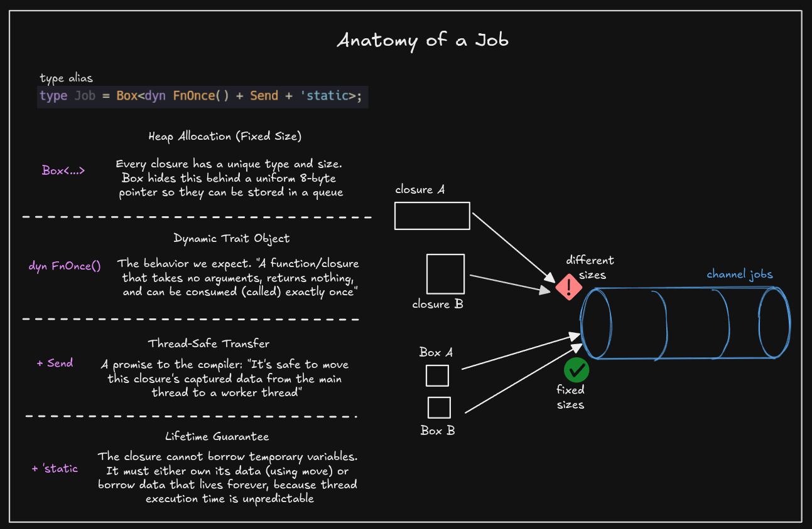
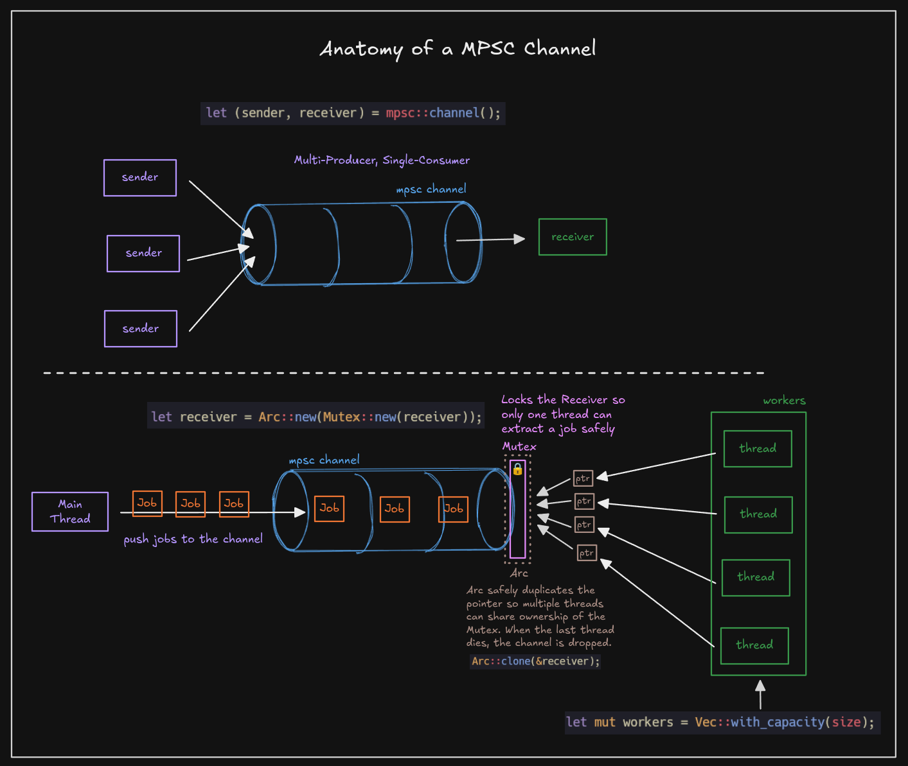
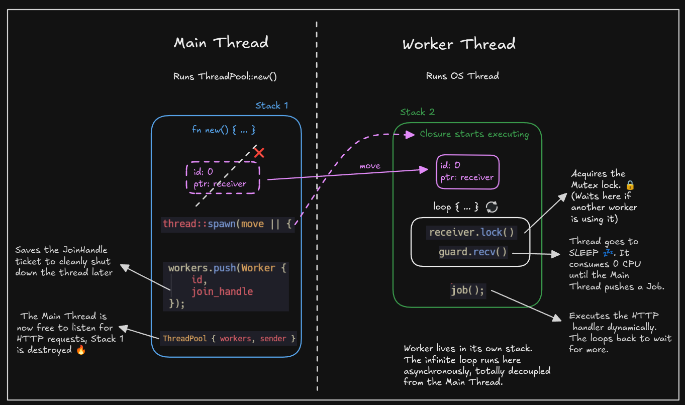
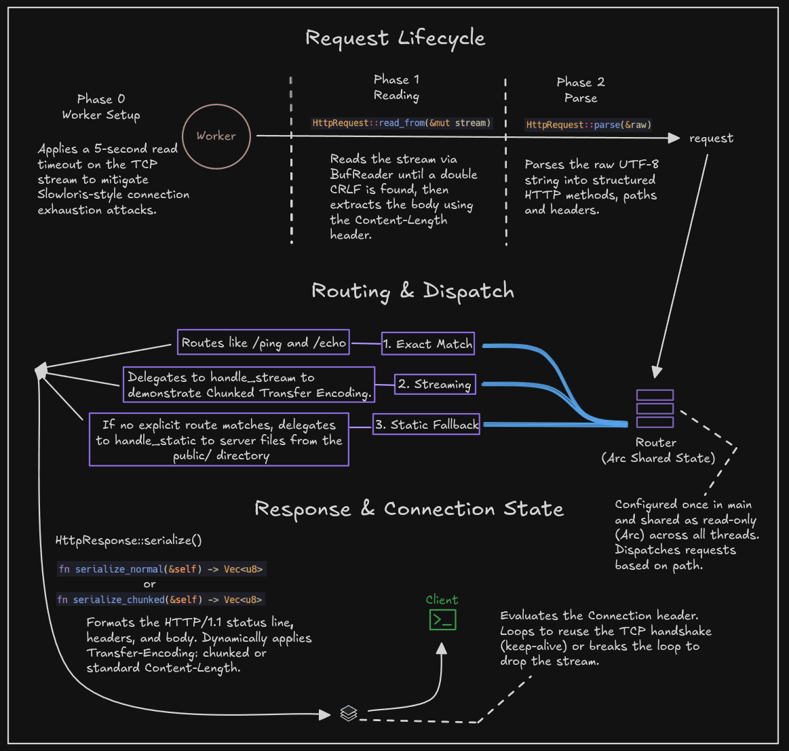
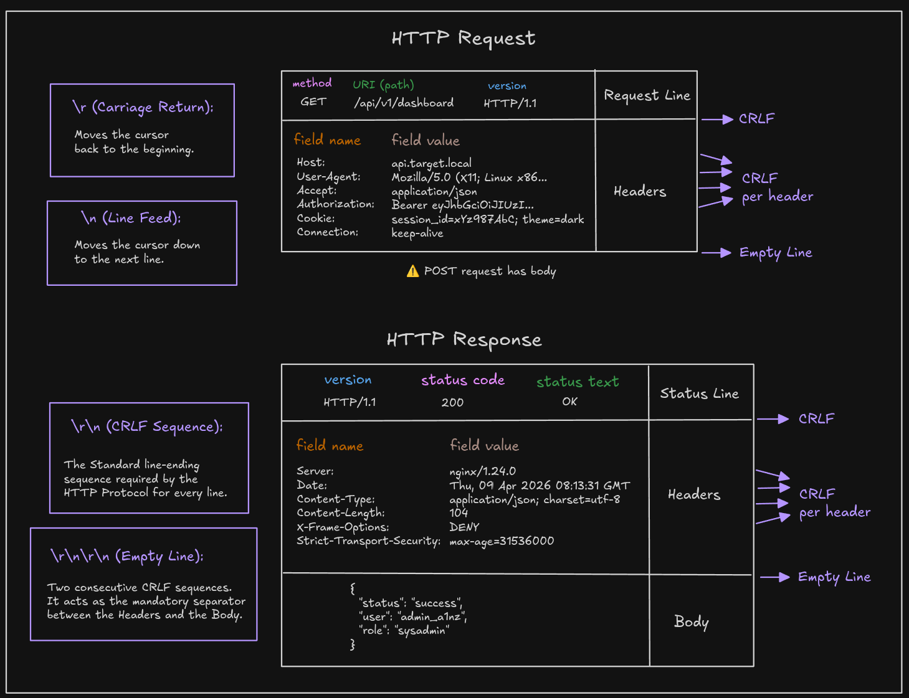
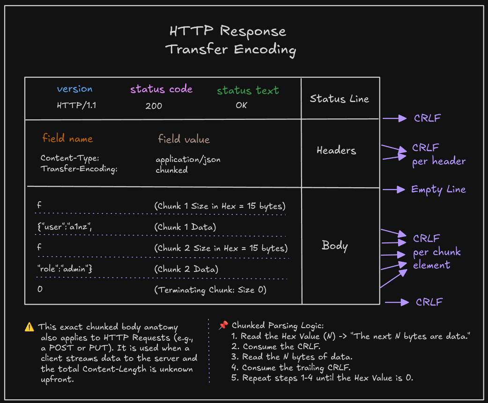

# xhttp

A minimal HTTP/1.1 server from scratch in Rust. No external dependencies — only the standard library. Every byte on the wire, every thread in the pool, and every header parser is hand-written.

<p align="center">
  
</p>

## Overview

**xhttp** implements an HTTP/1.1 server on top of raw `TcpListener` sockets, without any web framework or async runtime. The program:

1. Binds a TCP listener and accepts incoming connections on the main thread
2. Wraps each connection in a closure (`Job`) and dispatches it to a hand-built **Thread Pool** through an `mpsc` channel
3. Parses each request manually, honoring `Content-Length` and case-insensitive headers
4. Routes the request through a `HashMap`-based router with closure handlers
5. Serializes the response — either as `Content-Length` or `Transfer-Encoding: chunked`
6. Reuses the TCP connection across requests via HTTP/1.1 **Keep-Alive**, with a 5-second read timeout to mitigate Slowloris-style attacks
7. Performs a **graceful shutdown** through `Drop`, draining in-flight jobs before exiting

### Scope

| Implemented | Not Implemented |
|---|---|
| HTTP/1.1 request parsing (request line, headers, body) | TLS / HTTPS |
| `Content-Length` body reading | Async I/O (Tokio, `epoll`) |
| Response serialization (`Content-Length` + chunked) | HTTP/2 frame layer |
| Router with closure handlers (`Fn + Send + Sync`) | Cookie / session management |
| Static file serving with MIME type detection | Compression (gzip, brotli) |
| Manual fixed-size Thread Pool over `mpsc` channels | Request pipelining |
| HTTP/1.1 Keep-Alive with idle timeout | URL query string parsing |
| Graceful shutdown via `Drop` trait | Multipart form parsing |
| Slowloris mitigation (`set_read_timeout`) | Range requests |
| `400 Bad Request` on parse failures | |

## Project Structure

```
xhttp/
├── src/
│   ├── main.rs              # Server entry point: binds, routes, dispatches
│   ├── thread_pool.rs       # Fixed-size worker pool over mpsc + Mutex
│   ├── router.rs            # HashMap-based router with closure handlers
│   ├── handlers.rs          # Built-in handlers: ping, echo, static, stream
│   └── http/
│       ├── mod.rs           # Module exports + CRLF constant
│       ├── method.rs        # HttpMethod enum
│       ├── request.rs       # Request reading (BufReader) + parsing
│       └── response.rs      # Response building + serialization
├── public/                  # Files served by the static fallback handler
└── Cargo.toml               # Edition 2024, zero dependencies
```

## How It Works

The server is split across two concerns: the **concurrency engine** (how connections are dispatched to workers) and the **request lifecycle** (what each worker does with a connection). The diagrams below trace each one in detail.

---

### Concurrency Engine — Accept, Dispatch, Respond

The main thread never handles a request. It accepts TCP connections and pushes them — wrapped in closures — into an `mpsc` channel. A fixed pool of worker threads competes for jobs through an `Arc<Mutex<Receiver>>`, processes the request to completion, and writes the response **directly** back to the client without re-entering the channel.

<p align="center">
  
</p>

This split keeps the accept loop non-blocking: even if all four workers are busy serving slow clients, new TCP connections can still be accepted and queued. The pool size caps memory usage — spawning one OS thread per request would burn ~8 MiB of kernel stack per connection on Linux.

#### Anatomy of a Job

The unit of work submitted to the pool is a boxed closure: `Box<dyn FnOnce() + Send + 'static>`. Each trait bound is load-bearing — together they encode every constraint required to move work safely between threads.

<p align="center">
  
</p>

- `FnOnce()` — the job runs exactly once and is consumed in the process
- `Send` — the closure (and its captured data) can cross thread boundaries
- `'static` — the closure may not borrow data from the caller's stack, since workers can outlive the function that submitted the job
- `Box<dyn ...>` — closures have anonymous, unsized types; boxing erases the type and gives every job a uniform pointer the channel can carry

#### Anatomy of the MPSC Channel

Rust's `std::sync::mpsc` is **Multi-Producer, Single-Consumer**: any number of `Sender`s can push, but only one `Receiver` can pull. To distribute jobs across multiple workers, the `Receiver` is wrapped in `Arc<Mutex<...>>` so workers share ownership and serialize access to `recv()`.

<p align="center">
  
</p>

The `Mutex` is held only long enough to extract a `Job` — never during execution. Holding the lock across `job()` would serialize the entire pool behind a single worker (the **Selfish Worker** anti-pattern). The fix is a deliberately scoped inner block in `thread_pool.rs` that drops the `MutexGuard` before invoking the job.

#### Main Thread vs Worker Thread

Each worker runs on its own OS thread with its own stack. The main thread builds the pool, registers routes, and then sits in the `accept()` loop forever; workers loop on `recv()`, run the job, and loop back.

<p align="center">
  
</p>

When the `ThreadPool` goes out of scope, `Drop` runs in two phases: (1) the `Sender` is dropped, closing the channel and causing every worker's next `recv()` to return `Err`; (2) each `JoinHandle` is awaited, guaranteeing in-flight jobs finish before the program exits. Reversing the order would deadlock — workers would block on `recv()` waiting for jobs that will never arrive.

---

### Request Lifecycle — Inside a Worker

Once a worker pulls a job off the channel, it owns the `TcpStream` for the lifetime of the connection. The lifecycle below repeats inside a `while let Ok(...)` loop until the client closes the connection, the read times out, or `Connection: close` is set.

<p align="center">
  
</p>

#### Phase 0 — Worker Setup

A 5-second read timeout is applied to the socket once, before entering the keep-alive loop. Without it, a single idle client could pin a worker indefinitely — Slowloris attacks exploit exactly this by opening sockets and sending headers one byte at a time.

#### Phase 1 — Reading

`HttpRequest::read_from` pulls one full request off the stream. It reads line by line through a `BufReader` until it sees the empty `CRLF` that terminates the header section, scans those headers for `Content-Length`, then uses `read_exact` to pull *exactly* that many body bytes off the wire. A single `read()` call would be insufficient — TCP is a byte stream, and a request can be split across arbitrary read boundaries.

#### Phase 2 — Parse

`HttpRequest::parse` splits the raw string at the double `CRLF` separating head from body, parses the request line (`GET /path HTTP/1.1`), and walks the header lines into a `HashMap`. Header lookups are case-insensitive per RFC 9110 — `content-length`, `Content-Length`, and `CONTENT-LENGTH` must all compare equal.

<p align="center">
  
</p>

#### Routing & Dispatch

The `Router` is a `HashMap<String, Handler>` built once on the main thread and then frozen inside an `Arc` so every worker can read it concurrently. Three dispatch outcomes are possible:

1. **Exact match** — a registered path like `/ping`, `/echo`, or `/stream` runs its closure handler
2. **Static fallback** — unmatched paths are delegated to `handle_static`, which serves files from the `public/` directory with MIME type detection
3. **404 Not Found** — if the static handler can't read the file

The router takes `&self` (not `&mut self`) at request time, which is what allows it to be shared across threads through `Arc` without coordination.

#### Response & Connection State

`HttpResponse::serialize()` dispatches to one of two encoders based on the response's `chunked` flag:

- `serialize_normal` — emits a single `Content-Length: N` header followed by the full body
- `serialize_chunked` — emits `Transfer-Encoding: chunked` and frames the body as size-prefixed chunks terminated by a zero-length chunk

<p align="center">
  
</p>

Chunked encoding is what lets a server start sending a response before knowing its total size — useful for streamed payloads, server-sent events, or any handler that produces output incrementally. Sending both `Content-Length` and `Transfer-Encoding: chunked` is illegal per RFC 9112 because the two would conflict.

After writing the response, the worker checks the `Connection` header (defaulting to keep-alive on HTTP/1.1, close on HTTP/1.0). If the connection persists, the worker loops back to Phase 1 on the same socket — avoiding a fresh TCP handshake per request. If it closes, the loop breaks and the `TcpStream` is dropped, releasing the file descriptor.

## Setup

### Prerequisites

- Rust 1.85+ (edition 2024 + let chains)
- No other dependencies

### Build

```bash
cargo build --release
```

### Run

```bash
cargo run --release
```

The server binds to `127.0.0.1:7878`.

### Try It

Smoke test the built-in routes:

```bash
# Exact-match route
curl -v http://127.0.0.1:7878/ping
# → pong

# Echo a body back
curl -v -X POST -d 'hello world' http://127.0.0.1:7878/echo

# Chunked transfer encoding
curl -v --raw http://127.0.0.1:7878/stream

# Static fallback (served from public/)
curl -v http://127.0.0.1:7878/index.html
```

Verify keep-alive reuses a single TCP connection for multiple requests:

```bash
curl -v http://127.0.0.1:7878/ping http://127.0.0.1:7878/ping http://127.0.0.1:7878/ping 2>&1 | grep -E '(Re-using|Connections:|Connection #)'
```

### Run the Tests

The thread pool is covered by three unit tests, including a `Barrier`-based parallelism test that detects the Selfish Worker bug via deadlock.

```bash
cargo test
```

## Tools Used

| Tool | Purpose |
|---|---|
| **Rust (std only)** | Language and standard library — `std::net`, `std::sync`, `std::thread`, `std::io` |
| **cargo** | Build, test, and clippy lints |
| **curl** | Manual request testing and keep-alive verification |
| **Excalidraw** | Hand-drawn architecture and lifecycle diagrams |

---

<p align="center">
  Made with ❤️ and Rust.
</p>
